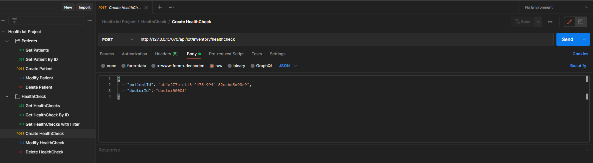

# Health IoT Inventory - RESTful HTTP API
> The project aims to create an HTTP REST API for interaction by a client with the resources hosted on 
> the Data Manager and Collector (server), i.e. patient and healthcheck. Furthermore, the data manager and collector 
> can receive telemetry data, manipulate and map them on the healthcheck, with the ability to detect anomalies 
> on measurement data.
> 
> The API is exposed through a configurable port (7070) and accessible locally at: http://127.0.0.1:7070/api/iot/inventory/

## Table of Contents
* [General Info](#general-information)
* [Technologies Used](#technologies-used)
* [Screenshots](#screenshots)
* [Setup](#setup)
* [Modeled REST Resources](#modeled-rest-resources)
* [Usage](#usage)
* [Project Status](#project-status)
* [Room for Improvement](#room-for-improvement)
* [Acknowledgements](#acknowledgements)
* [Contact](#contact)
<!-- * [License](#license) -->

## General Information
- The maven project contains all the software needed to simulate the scenario. But during the presentation, my team's mate Jacopo Maragna and I are going to use his project as MQTT publisher. 
- The project intends to provide a standard approach on how to manage, with a RESTful approach, resources on a server and map telemetry data to those resources.
- The purpose of the project is to prototype a medical environment where a doctor can register new patients and create related health checks, as well as obtain, modify and delete patient data and created health checks.

## Technologies Used
- Java - version 1.7
- Dropwizard - version 1.3.9
- Jackson - version 2.9.8
- Gson - version 2.8.6
- ModelMapper - version 2.4.5
- Paho - version 1.2.1
- PostMan - version 9.13.0

## Screenshots

## Setup
Clone the repo from my GitHub
https://github.com/Superzano/HealthIotProject.git and open it as a IntelliJ project.

_Note: you need valid and effective credentials in order to use the cloud broker. Here in the repo's code credentials are ineffective for privacy reasons._

## Modeled REST Resources

The IoT Inventory resources currently modeled are:

- Patient (/patient): A generic representation of a patient with basic information and customizable attributes.
- Healthcheck (/healthcheck): A generic representation of a medical test, associated with a patient, with basic information and customizable attributes.

## Usage
#### Simplest way
Run AppService (in the service package) and then start interacting with the resources through PostMan: you can manipulate
the resources with CRUD interactions, thanks to the collection that I exported in the api package of this project.
#### Fully potential 
Run SmartWatchProcessGUI (in the process package) on Jacopo's machine, simultaneously run AppService on your machine.
Then keep caution about the following coordination step:
1. Press the button 'on' on Jacopo's machine.
2. Press the button 'start' on Jacopo's machine.
3. Make a post request from PostMan on your server.
4. Press the button 'send' from Jacopo's machine to measure.
5. At this point, from Jacopo's machine, you can either start a new cycle of measurements going back to the point 2. or press the button 'off' to disconnect the client and turn off the device.

## Project Status
Project is _complete_ for the exam's presentation.

## Room for Improvement

- Implement persistence with a database
- Implement a more complex anomaly detection through Machine Learning algorithms

## Acknowledgements

- This project was inspired by the ideas of both me and Jacopo Maragna.
- This project was based on Marco Picone's lectures (Ph.D. - picone.m@gmail.com).
- Many thanks to Jacopo Maragna (271504@studenti.unimore.it) to collaborate with me on the writing of the codebase.

## Contact
Created by Christopher Zanoli (270765@studenti.unimore.it) - feel free to contact me!

